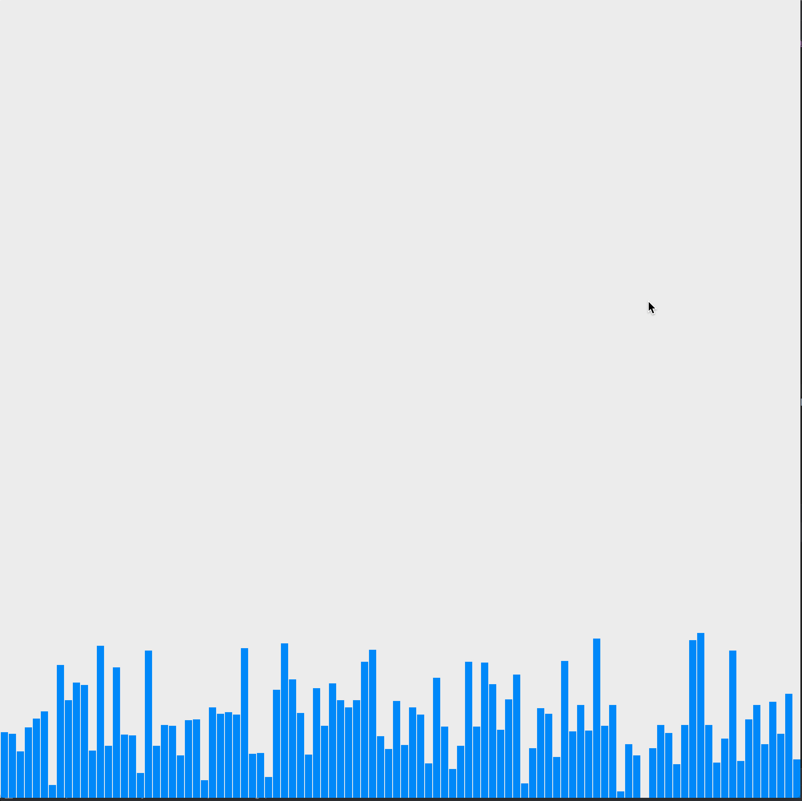
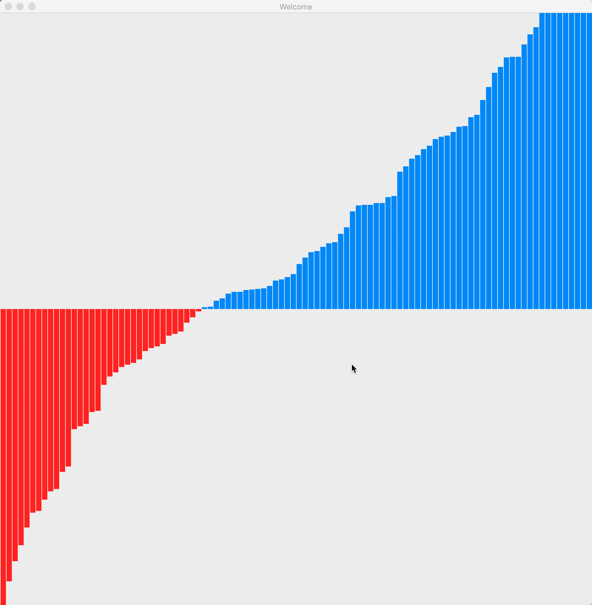
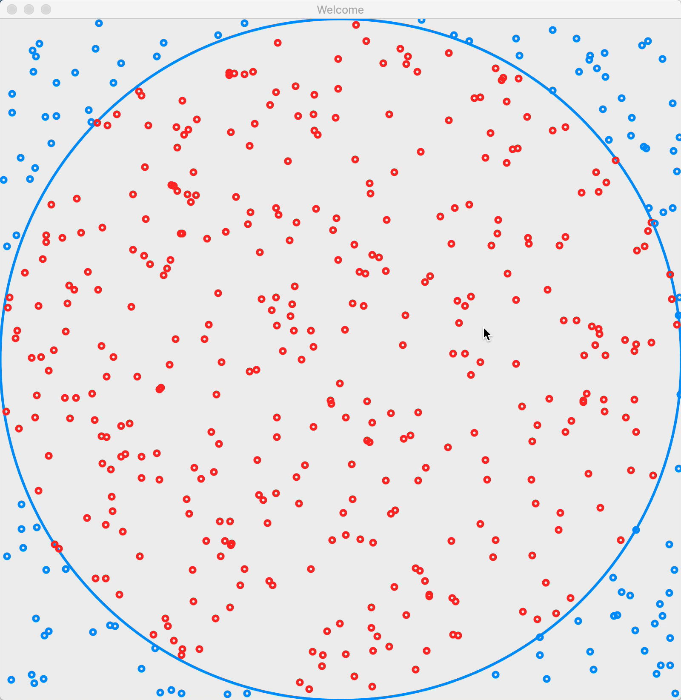
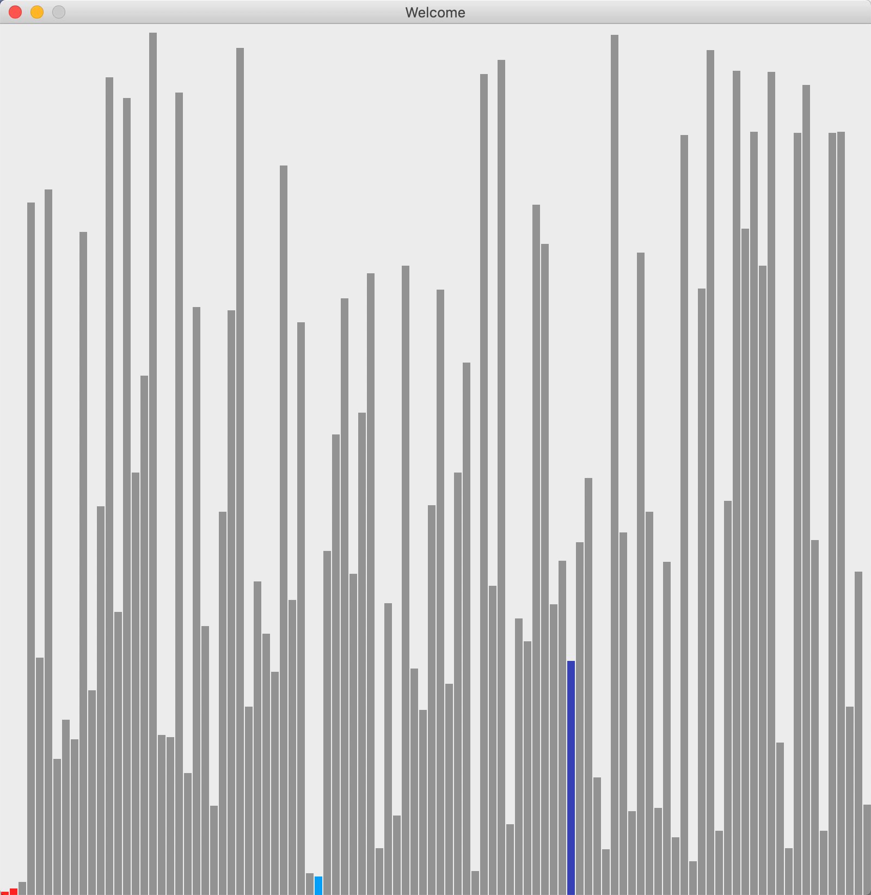
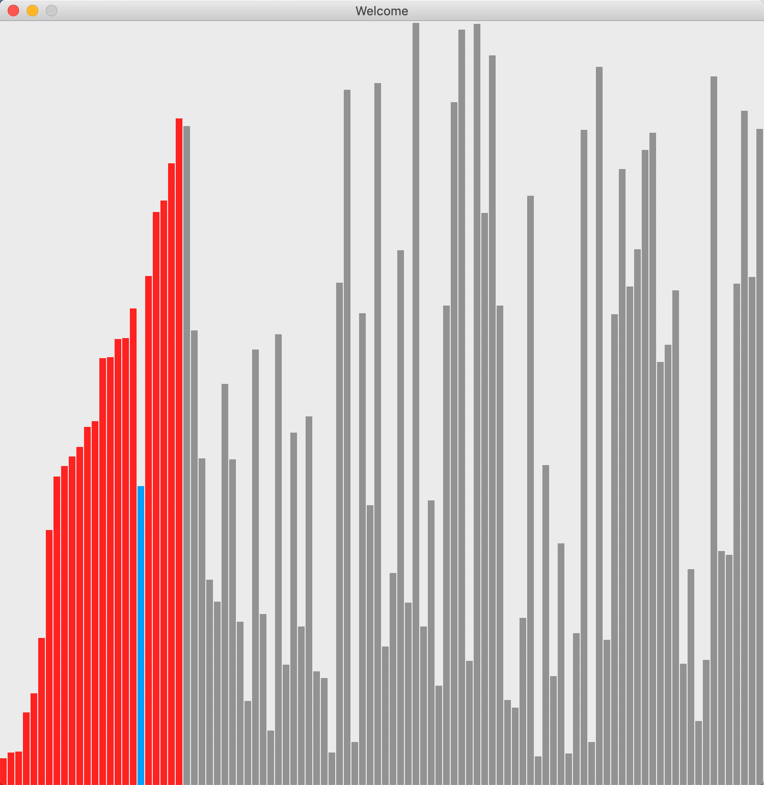
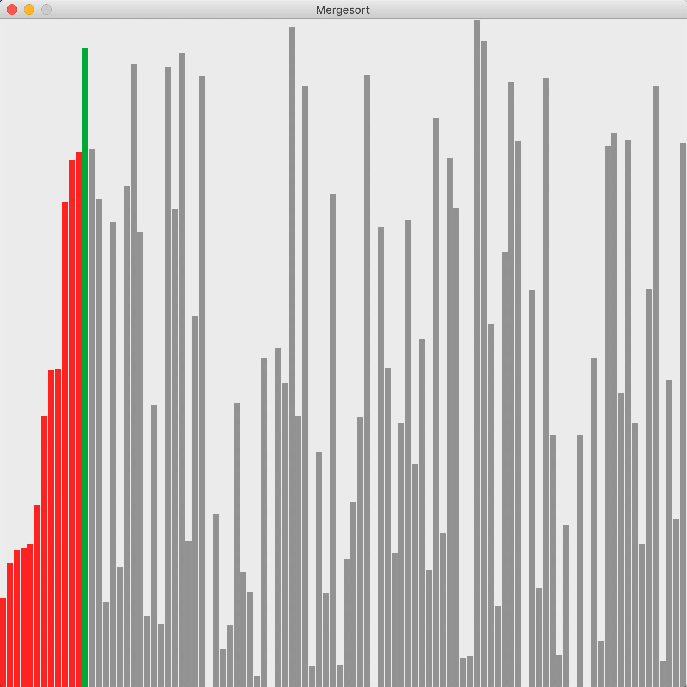
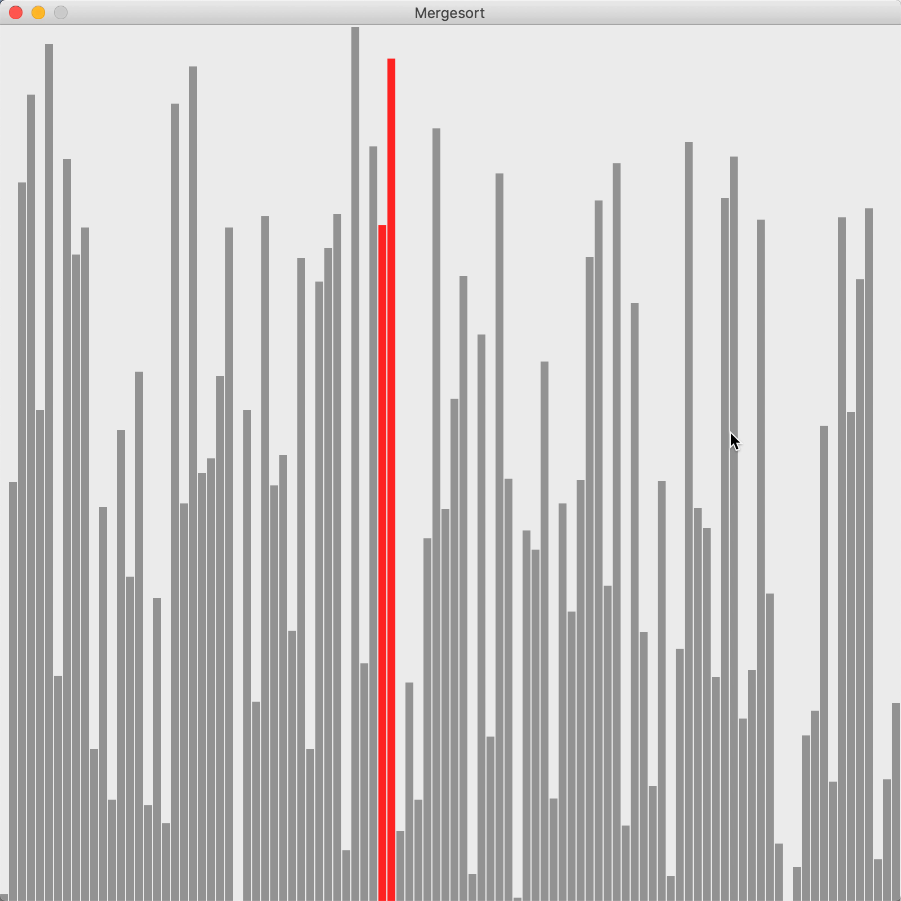

#  Algorithms visible 
## Chapitre 1
simple example of java swing

## Chapitre 2 随机问题（蒙特卡洛）

### 分钱问题
房间里有100个人，没人都有100元钱，他们在玩一个游戏。每轮游戏中，没人都要拿出一元钱给另一个人，最后这100人的财富分布怎么样？

1.	假设所有人钱都大于0

2.	假设人可以小于0

## Chapitre 3 随机问题（蒙特卡洛）
使用蒙特卡洛算法计算 圆周率 通过正方形和圆形面积比值

最后能算出 ：3.147878787878788

## Chapitre 5 排序可视化

### 选择排序

### 插入排序

### 归并排序
自顶向下

自底向上

### 冒泡排序

